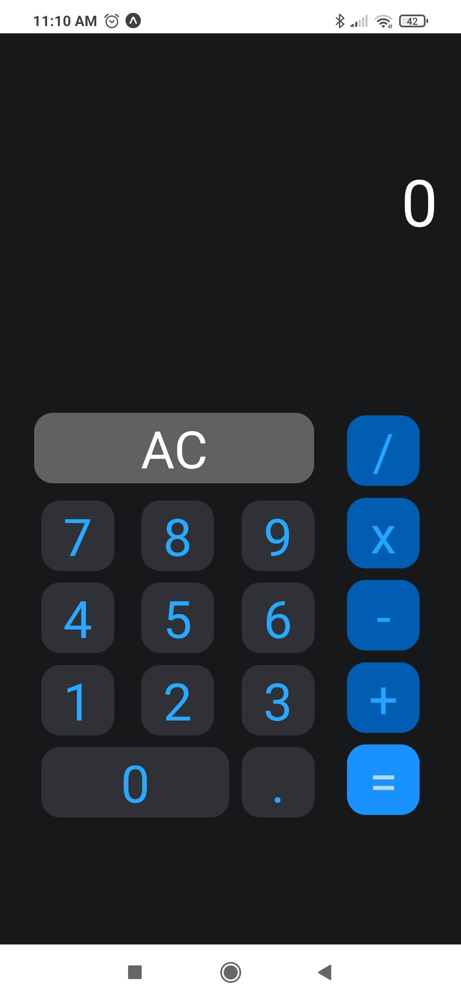

# CALCULATOR APP

This is a simple app made with React Native

`Prototype layout from figma: ` [see on figma](https://www.figma.com/file/E7RGigzQeBYdEvf5oXAnqy/Calculator-App-Ui-Design-Download-Free-(Community)?node-id=74-244&t=puXTrAeSjOwd9ZRK-0)

 

## Adaptative layout

 

# Tools

- **React Native** with Expo
- JavaScript
- Figma

 

# How run
1. Clone this repository
    ~~~bash
    git clone https://github.com/araujo0608/calculator.git
    ~~~
2. You need install all dependencies of the project (see in `package.json` file) 

3. run: `npx expo start`